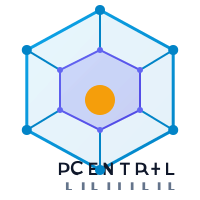

# D Central Brand Guide

## Version 1.0 | May 2025

---

## 1. Brand Overview

### Mission
D Central provides a decentralized governance platform designed to enable secure, transparent, and efficient operation of distributed systems.

### Vision
A world where decentralized systems are accessible, secure, and governed with complete transparency.

### Brand Personality
- **Trustworthy**: Reliable, secure, and committed to protecting data
- **Innovative**: Pioneering in decentralized governance
- **Inclusive**: Designed for communities to participate equally
- **Transparent**: Open processes and decision-making
- **Technical**: Expert and precise in implementation

---

## 2. Logo

### Primary Logo
Our primary logo is the D Central mesh node icon paired with the wordmark. This is our preferred logo for most applications.

### Logo Variations
- **Icon Only**: For small spaces or when the brand is already established in context
- **Wordmark Only**: For horizontal spaces where the icon doesn't fit
- **Stacked**: For vertical layouts

### Clear Space
Always maintain a minimum clear space around the logo equal to the height of the "D" in the wordmark.

### Minimum Size
- Digital: The logo should never be smaller than 24px in height
- Print: The logo should never be smaller than 0.25 inches in height

### Incorrect Logo Usage
- Do not distort or stretch the logo
- Do not change the colors outside of approved variations
- Do not add effects such as shadows or glows
- Do not place on busy backgrounds without sufficient contrast
- Do not rotate the logo

---

## 3. Color Palette

### Primary Colors

#### Primary Blue
- **Hex**: #0284C7
- **RGB**: 2, 132, 199
- **CMYK**: 99%, 34%, 0%, 22%
- **Usage**: Main brand color. Use for primary buttons, icons, and key UI elements.

#### Secondary Indigo
- **Hex**: #6366F1
- **RGB**: 99, 102, 241
- **CMYK**: 59%, 58%, 0%, 5%
- **Usage**: Accent color for secondary actions, hover states, and supporting elements.

### Supporting Colors

#### Neutral Gray
- Base: #4B5563
- Range: 50-950 shades available
- **Usage**: Text, backgrounds, borders, and supporting UI elements.

#### Success Green
- Base: #10B981
- Range: 50-950 shades available
- **Usage**: Success states, confirmations, positive metrics.

#### Warning Amber
- Base: #F59E0B
- Range: 50-950 shades available
- **Usage**: Caution states, important notifications.

#### Danger Red
- Base: #EF4444
- Range: 50-950 shades available
- **Usage**: Error states, destructive actions, critical alerts.

### Color Accessibility

All color combinations in this guide meet WCAG 2.1 AA standards with a minimum contrast ratio of 4.5:1 for normal text and 3:1 for large text and UI components.

---

## 4. Typography

### Primary Font: Inter

Inter is our primary sans-serif typeface for all communications, interfaces, and documents.

#### Weights
- 400 Regular: General body text
- 500 Medium: Subheadings and emphasized text
- 600 Semibold: Buttons and UI elements
- 700 Bold: Headings and important callouts

### Monospace Font: JetBrains Mono

JetBrains Mono is used for code display, technical documentation, and developer-focused content.

#### Weights
- 400 Regular: Code blocks and technical specifications
- 700 Bold: Emphasized code or commands

### Text Hierarchy

#### Headings
- H1: 3rem (48px), 700 Bold
- H2: 2.25rem (36px), 700 Bold
- H3: 1.875rem (30px), 600 Semibold
- H4: 1.5rem (24px), 600 Semibold
- H5: 1.25rem (20px), 500 Medium
- H6: 1rem (16px), 500 Medium

#### Body Text
- Large: 1.125rem (18px), 400 Regular
- Regular: 1rem (16px), 400 Regular
- Small: 0.875rem (14px), 400 Regular

---

## 5. Imagery & Illustrations

### Photography Style
- Clean, high-contrast images
- Technology-focused, showing networks and connections
- Diverse representation of users and environments
- Minimal, uncluttered compositions

### Illustration Style
- Geometric, with nodes and connection patterns
- Line weight consistency
- Blue gradient accents matching primary palette
- Abstract representation of decentralized networks

### Icons
- Line icons with 2px stroke
- Rounded corners (2px radius)
- Clean and minimal
- Use primary blue for interactive icons

---

## 6. Voice & Tone

### Brand Voice
- **Clear**: Straightforward and jargon-free when possible
- **Confident**: Authoritative but not arrogant
- **Helpful**: Focused on solutions and user needs
- **Technical**: Precise when discussing features and specs

### Writing Guidelines
- Use active voice when possible
- Keep sentences concise and to the point
- Avoid buzzwords and unnecessary technical jargon
- Be inclusive and accessible in language
- Address the reader directly using "you"

---

## 7. UI Components

See our Storybook documentation for interactive examples of all UI components.

### Buttons
- **Primary**: Blue background, white text
- **Secondary**: Indigo background, white text
- **Danger**: Red background, white text
- **Ghost**: Transparent background, colored text
- All buttons use 0.5rem border radius

### Forms
- Input fields with light gray borders
- Clear focus states with blue outline
- Validation states with appropriate colors
- Consistent spacing and alignment

### Cards
- White background
- Light shadow
- 0.5rem border radius
- Consistent internal padding

---

## 8. Application

### Website
- Clean, minimal layout
- Consistent navigation
- Mobile-responsive design
- Fast loading times

### Mobile App
- Native components with brand styling
- Consistent spacing system
- Accessibility considerations
- Dark mode support

### Documentation
- Clear hierarchy
- Code syntax highlighting
- Visual aids when helpful
- Consistent formatting

---

## Contact

For questions about brand usage or to request assets, contact:

design@dcentral.ai