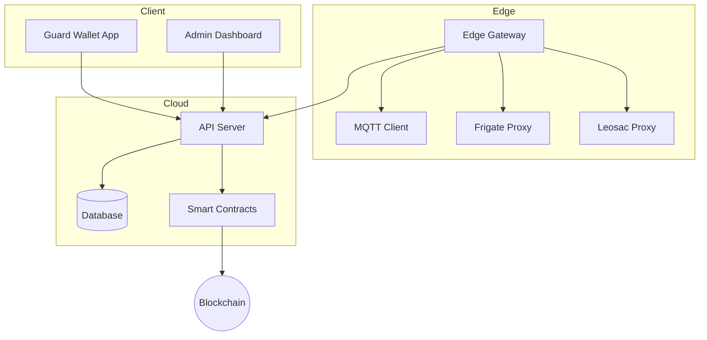

# Architecture Overview

The D Central Platform architecture consists of several key components working together to provide a secure, decentralized governance solution.

## System Components

## Edge Gateway

The Edge Gateway is responsible for secure communication between edge devices and the cloud infrastructure. It handles:

- Device authentication and authorization
- Data preprocessing and filtering
- Local decision making
- Secure communication with cloud services

For more details, see the [Edge Gateway documentation](secure-edge_diagram.md).

## Smart Contracts

Our smart contracts provide:

- Immutable record of governance decisions
- Transparent voting mechanisms
- Decentralized identity verification
- Tokenized incentive structures

## Mobile Guard Wallet

The mobile application provides:

- Decentralized identity management
- Shift management and check-ins
- Credential storage and verification
- Real-time alerts and notifications