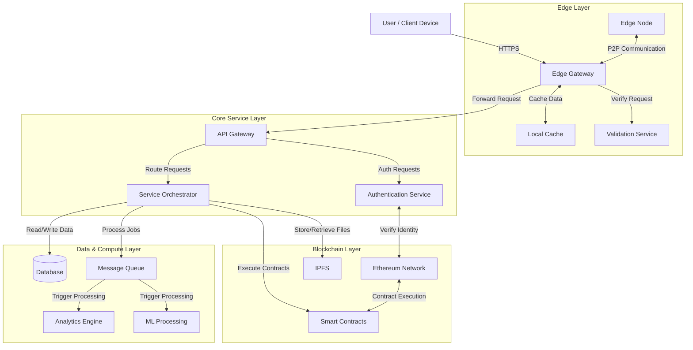
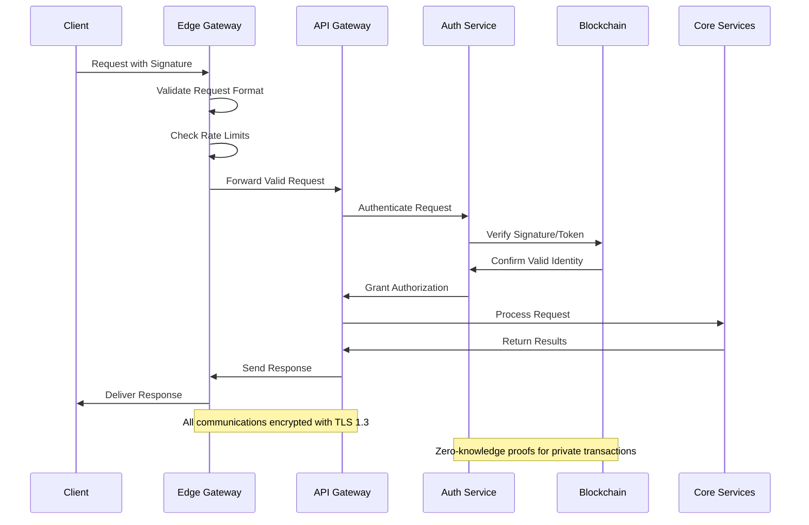
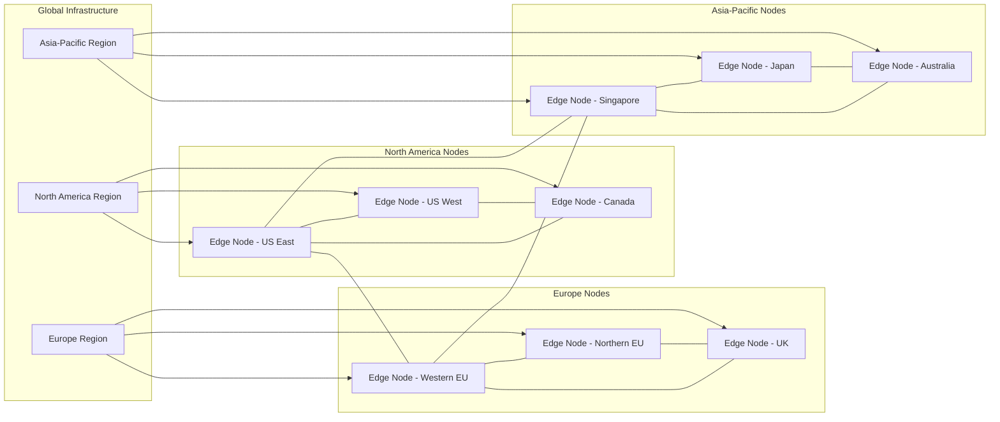
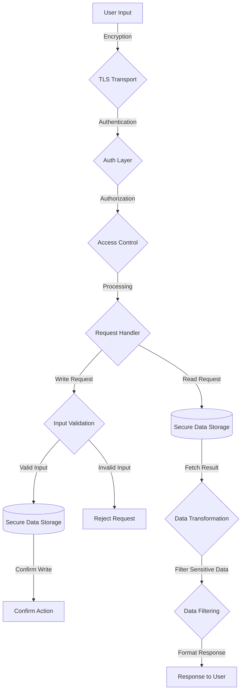

# Secure Edge Architecture Diagram

This document describes the secure edge architecture for the DCentral platform, illustrating how edge nodes interact with the blockchain and cloud services.

## System Architecture Overview

## Security Flow

## Edge Node Deployment

## Secure Data Flow

## Technology Stack

| Layer | Technologies |
|-------|--------------|
| Edge Layer | Envoy, Nginx, Redis, Go |
| API Layer | Kong, FastAPI, OAuth 2.0 |
| Core Services | Node.js, Python, gRPC |
| Blockchain | Ethereum, IPFS, Solidity |
| Data | PostgreSQL, TimescaleDB, Kafka |
| Security | TLS 1.3, ZKPs, HSMs |
| Infrastructure | Kubernetes, Terraform, Docker |

## Security Controls

- End-to-end encryption for all communications
- Zero-knowledge proofs for privacy-preserving validation
- Hardware security modules (HSMs) for key management
- Rate limiting and DDoS protection at the edge
- Real-time threat monitoring and alerting
- Automated security scanning and compliance checks
- Formal verification of critical smart contracts
- Multi-factor authentication for administrative access
- Regular security audits and penetration testing
- Geographic data sovereignty compliance

## Future Enhancements

- Quantum-resistant cryptographic schemes
- Enhanced privacy-preserving computation at the edge
- Cross-chain interoperability with additional blockchain networks
- Decentralized identity integration with DIDs and VCs
- Advanced anomaly detection using machine learning
- Enhanced governance voting mechanisms for protocol upgrades